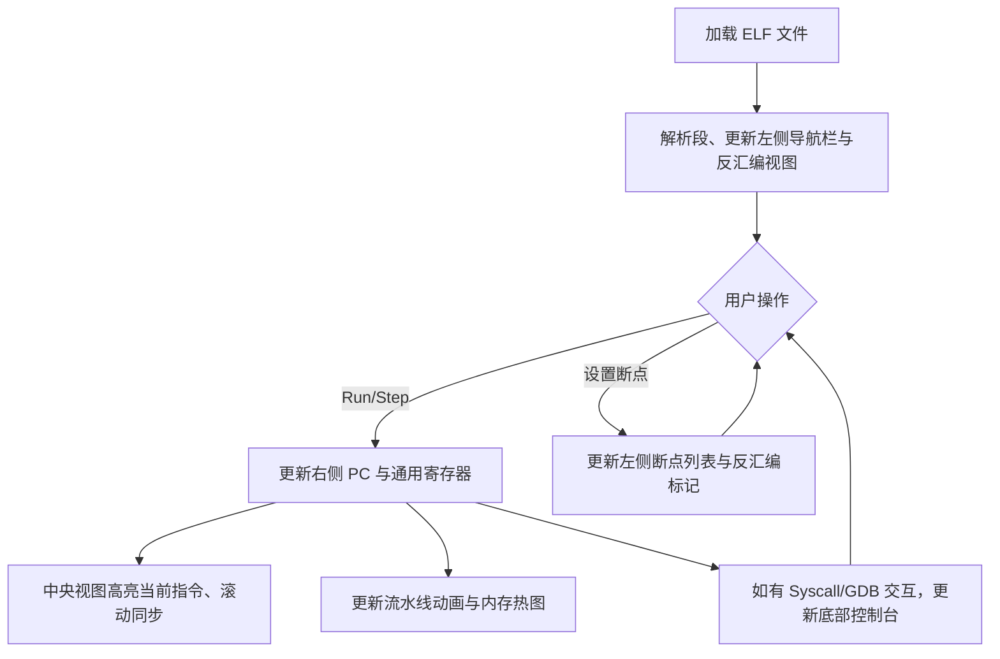

# RISC-V Execution Studio 产品需求文档

## 1. 产品概述
本项目是一个面向 RISC-V 程序的专业级可视化工作台，将模拟器、调试器、性能分析器与远程调试控制台融合。
它旨在通过高亮状态反馈和微架构仪表盘，提供清晰的信息层次，帮助用户实时观察程序执行流、CPU 内部状态、性能瓶颈以及 GDB 协议交互。这不仅是一个前端界面，更是一个能够完美展示 RISC-V 流水线、系统调用等核心机制的教学与演示平台。

## 2. 核心功能

### 2.1 模块与页面结构
本项目采用 **“Dock 面板 + 中央工作区 + 时间轴底栏”** 的专业工作台布局结构，单页面包含多个核心视图模块。

1. **顶部工具栏**：控制程序运行和全局调试操作。
2. **左侧导航栏**：管理程序结构、ELF 信息、断点与内存区域导航。
3. **中央主视图**：多 Tab 结构，承载最核心的代码执行与微架构分析。
4. **右侧状态栏**：CPU 的“仪表盘”，实时展示寄存器、PC 和性能统计。
5. **底部控制台**：系统行为与 GDB 协议交互的日志输出窗口。

### 2.2 核心模块详细描述
| 模块名称 | 子模块 | 功能描述 |
|---------|--------|----------|
| 顶部工具栏 | 运行控制 | Open ELF, Run, Pause, Step, Step Over/Out, Reset, Stop |
| 顶部工具栏 | 高级操作 | Attach GDB, Start RSP Server, Snapshot, Export Trace |
| 左侧导航栏 | 调试对象管理 | ELF 信息, 段/节区, 断点列表, Watchpoints, Syscall 记录, 内存访问区域 |
| 中央主视图 | Tab 1 反汇编视图 | 指令地址、反汇编文本、当前 PC 高亮平滑滚动、断点标记、分支目标箭头 |
| 中央主视图 | Tab 2 源码映射视图 | C/ASM 源码展示、当前行高亮、与指令地址联动 |
| 中央主视图 | Tab 3 流水线视图 | 五级流水线 (IF/ID/EX/MEM/WB) 可视化、stall/flush 动画与高亮提示 |
| 中央主视图 | Tab 4 内存热图 | 地址区间、读写频率热点、代码/数据/栈/堆语义化边界展示 |
| 右侧状态栏 | CPU 仪表盘 | x0~x31 寄存器 (写操作短暂发光)、PC、CSR、退出码、CPI/Stalls/Flushes 指标 |
| 底部控制台 | 日志与终端 | syscall 输出、debug log、GDB RSP 状态日志、异常与命中断点提示 |

## 3. 核心流程
用户通过加载 ELF 文件开始，进行单步执行或连续运行，期间 UI 实时响应状态变更。



## 4. 用户界面设计

### 4.1 设计风格
- **整体风格**：深色专业调试器风格 + 高亮状态反馈 + 微架构仪表盘。
- **背景与底色**：深灰 / 深蓝黑，降低视觉疲劳。
- **高亮色盘**：
  - 当前 PC：亮蓝
  - 断点：红色
  - 运行中：绿色
  - 警告：橙色
  - 错误：红橙
  - flush / stall：紫色或黄色提示
- **排版与字体**：
  - 反汇编、内存、寄存器值使用等宽字体 (Monospace)。
  - UI 面板标题使用现代无衬线字体。
  - 数值统一对齐。
- **动效设计**：
  - 当前指令高亮平滑滚动。
  - 流水线格子轻微闪动。
  - 寄存器变化短暂发光。
  - 断点命中时明显的停顿和红框提示。

### 4.2 布局规划
采用网格和 Flexbox 构建经典 IDE 布局。
```text 
┌────────────────────────────────────────────────────────────────────┐ 
│  Toolbar: Open | Run | Pause | Step | Reset | GDB | Snapshot      │ 
├───────────────┬──────────────────────────────────┬─────────────────┤ 
│ Project / ELF │  Central Workspace               │ CPU State       │ 
│ - Sections    │  [Disassembly] [Source]          │ - Registers     │ 
│ - Breakpoints │  [Pipeline] [Memory Heatmap]     │ - FPU / CSR     │ 
│ - Watchpoints │  [Execution History]             │ - PC / State    │ 
├───────────────┴──────────────────────────────────┴─────────────────┤ 
│  Console / Syscall Output / GDB RSP Log / Errors                   │ 
└────────────────────────────────────────────────────────────────────┘ 
```

### 4.3 响应式设计
以桌面端为主 (Desktop-first)，因为这是一个专业级的高密度数据面板，不适合在手机端操作。采用 Flexbox 确保各面板在 1080p 及以上分辨率可以自由伸缩。
